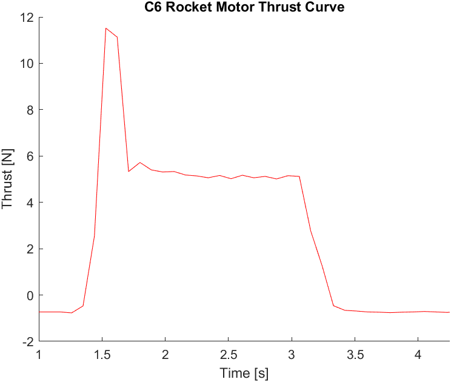

# Thrust-Stand-Project

The goal of this project is to develop a modular thrust stand capable of recording force data of small solid rocket propellant motors. The goal of this project was to develop a better understanding of solid rocket propellant motors, as well as use this thrust data to investigate how many motors our team would need to implement for the final rocket design.

## Table of Contents

- [Description](#Description)
- [Software and Hardware Required](#Software-and-Hardware-Required)
- [How to Use](#How-To-Use)
- [Data](#Data)

## Description

The project covers the electronic architecture behind the thrust stand. The software and hardware of the system will be covered, as well as the how to use the system safely and correctly. Experimental thrust data of a C6 solid propellant motor is also compared to a referenced model.

**WARNING: This project is solely for educational purposes, and should only be used for small solid rocket motors. Everything in this project must be handled with EXTREME caution, as it involves the ignition of a solid propellant motor. Keep humans and flammable objects away at a safe and large distance when the stand is under operation. Do not operate in small spaces. Tests for this project were conducted in open spaces with special permission. I am not responsible for any damages or injuries.**

## Software-and-Hardware-Required

#### Software

Arduino IDE

#### Hardware

1. Two Arduino Nano Microcontrollers (or ESP32)
2. HX711 Amplifier
3. RF69 Radio Reciever/Transmitter
4. SD Card Breakout Board
5. microSD Card and adapter
6. Igniter (Any low-ohm resistor is fine)
7. 10-50 kg Load Cell (depending on your rocket motor specifications)
8. PCB or Breadboards with Jumper wires

## How-To-Use

#### General Schematic


#### Libraries

1. HX711.h
2. SD.h
3. RF69.h
4. FS.h (if using ESP32)

#### Protocol

Before operation, wire an HX711/Load Cell system to an Arduino Nano. Use the Calibration Code to determine a calibration factor for the load cell.

The following code in TS_V20_1 begins Standby phase.

```C++

while (STANDBY)
  {
    Serial.println("Standby Phase Active");
    counter = 0;

    // Checks serial monitor for input
    while(Serial.available() > 0)
    {
      char databit = Serial.read(); 
      Data[counter] = databit;      
      counter++;                    
    }

    // Checks if input is same as action code
    if (Data[0] == ArmCd[0] && Data[1] == ArmCd[1] && Data[2] == ArmCd[2])
    {
      // Moves into ARMED PHASE
      STANDBY = false;
      ARMED = true;
    } 
```
In order to move on to the Armed Phase, the code will require user input. Input "!AR" into the Serial moniter to initiate the next sequence.

The following code in TS_V20_1 begins the Armed Phase. This phase is to notify all users to keep far away from the thrust stand.

```C++
 while (ARMED)
  {
    Serial.println("Armed Phase Active");
    counter = 0;

    // Checks serial monitor for input
    while(Serial.available() > 0)
    {
      char databit = Serial.read();
      Data2[counter] = databit;
      counter++;
    }

    // Checks if input is same as action code
    if (Data2[0] == IgnCd[0] && Data2[1] == IgnCd[1] && Data2[2] == IgnCd[2])
    {
      // Moves into PRE-IGNITION PHASE
      ARMED = false;
      PRE_IGNITION = true;
    } 
  }
```

Again, this phase will require user input to move on to the Pre-Ignition Phase. Input "!IG" to move on to the Pre-Ignition phase **once the entire premise around the thrust stand is completely clear**.

The Pre-Ignition phase is the last stage before ignition.

```C++
 while (PRE_IGNITION)
  {
    Serial.println("Pre-Ignition Phase Active");
    counter = 0;

    // Checks serial monitor for input
    while(Serial.available() > 0)
    {
      char databit = Serial.read();
      Data3[counter] = databit;
      counter++;
    }
    
    // Checks if input is same as action code
    if (Data3[0] == AbCd[0])
    {
      // Moves into DATA_ACQUISITION PHASE
      PRE_IGNITION = false;
      DATA_ACQUISITION = true;
    } 
```

Input "!" into the Serial moniter to exit this phase.

The load cell will now be set to the calibration factor and thrust data will be recorded upon igntion of the rocket motor. **Remember to stand clear of the thrust stand until the data is stored into the SD Card and the solid motor is completely burned**.

## Data

The following data was run on a C6 solid propellant motor. Thrust curve data was input to a MATLAB document. This experimental curve can be compared to the reference curve from [thrustcurve.org](https://www.thrustcurve.org/motors/Estes/C6/) for an Estes C6 motor. Comparing the two curves shows that the data collected below is reasonably accurate.


